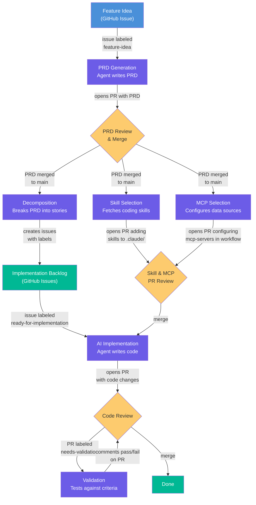

# Project Name

<!-- TODO: Replace with your project description -->

## Agentic Development Workflow

This project uses [GitHub Agentic Workflows (gh-aw)](https://github.github.com/gh-aw/) for automated development with Claude-powered agents.



### Quick Start

1. Customize `CLAUDE.md` with your project's architecture and conventions
2. Customize `.github/workflows/implementation.md` with your project's paths and commands
3. Compile workflows: `gh aw compile`
4. Create the `feature-idea` label: `gh label create feature-idea --color 0E8A16`
5. Create a feature idea issue and label it `feature-idea`

### Workflow Commands

```bash
gh aw list                  # List all workflows
gh aw run prd-generation    # Generate PRD from a feature idea issue
gh aw run decomposition     # Decompose a PRD into stories
gh aw run skill-selection   # Fetch coding skills for a PRD
gh aw run mcp-selection     # Configure MCP servers for implementation
gh aw run implementation    # Implement a story
gh aw run validation        # Validate an implementation PR
gh aw compile               # Recompile .lock.yml files after editing workflows
```

### Syncing Shared Workflows

Shared workflows are automatically synced weekly from [gh-aw-shared-workflows](https://github.com/RealPage/gh-aw-shared-workflows). To sync manually:

```bash
./scripts/sync-workflows.sh
gh aw compile
```
